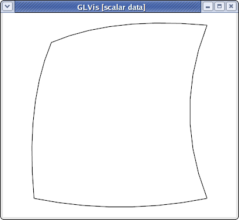
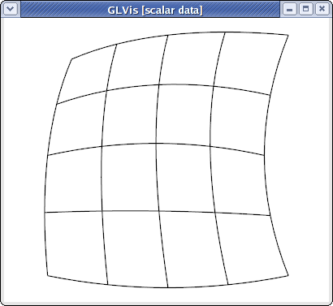
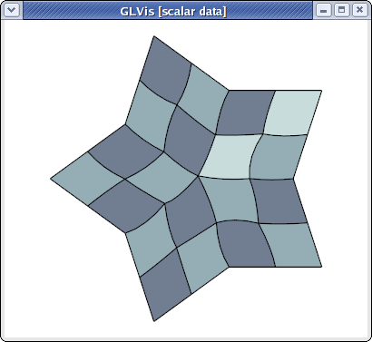
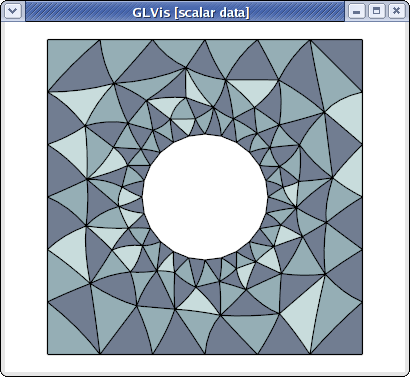
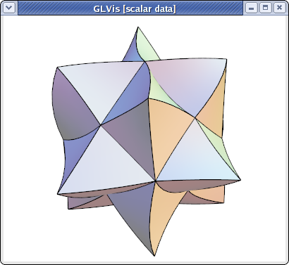
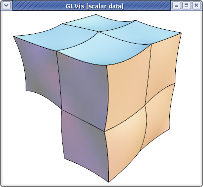

# Curvilinear VTK Meshes

## Summary

A simple tutorial how to visualize curvilinear meshes in VTK format with GLVis.

## Details

GLVis supports quadratic triangular, quadrilaterals, tetrahedral and hexahedral curvilinear meshes in VTK format. This format is described in the [VTK file format documentation](http://vtk.org/VTK/img/file-formats.pdf). The local numbering of degrees of freedom for the biquadratic quads and triquadratic hexes can be found in the Doxygen reference of the [vtkBiQuadraticQuad](http://www.vtk.org/doc/release/5.6/html/a00185.html) and [vtkTriQuadraticHexahedron](http://www.vtk.org/doc/release/5.6/html/a02039.html) classes. Currently VTK does not support cubic, and higher-order meshes.

As an example, consider a simple curved quadrilateral saved in a file `quad.vtk`:
```sh
# vtk DataFile Version 3.0
Generated by MFEM
ASCII
DATASET UNSTRUCTURED_GRID
POINTS 9 double
0 0 0
1 0 0
1 1 0
0.1 0.9 0
0.5 -0.05 0
0.9 0.5 0
0.5 1 0
0 0.5 0
0.45 0.55 0
CELLS 1 10
9 0 1 2 3 4 5 6 7 8
CELL_TYPES 1
28
CELL_DATA 1
SCALARS material int
LOOKUP_TABLE default
1
```
Visualizing it with "`glvis -m quad.vtk`" and typing "`Aemooo`" in the GLVis window we get:



The "`o`" key increases the reference element subdivision which gives an increasingly better approximation of the actual curvature of the element. To view the curvature of the mapping inside the element we can use the "O" key, e.g.,
```sh
glvis -m quad.vtk -k "AemOOooo"
```


Here is a slightly more complicated [quadratic quadrilateral](https://github.com/mfem/mfem/blob/master/data/star-q2.vtk) mesh example (the different colors in the GLVis window are used to distinguish neighboring elements):
```sh
glvis -m star-q2.vtk -k "Am"
```


GLVis can also handle [quadratic triangular](https://github.com/mfem/mfem/blob/master/data/square-disc-p2.vtk) meshes:
```sh
glvis -m square-disc-p2.vtk -k "Am"
```


As well as [quadratic tetrahedral](https://github.com/mfem/mfem/blob/master/data/escher-p2.vtk) and [quadratic hexahedral](https://github.com/mfem/mfem/blob/master/data/fichera-q2.vtk) VTK meshes:
```sh
glvis -m escher-p2.vtk -k "Aaaaooooo**************"
```

```sh
glvis -m fichera-q2.vtk -k "Aaaaooooo*****"
```

