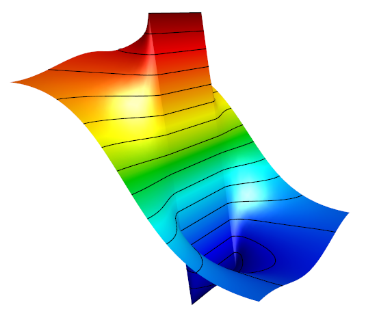
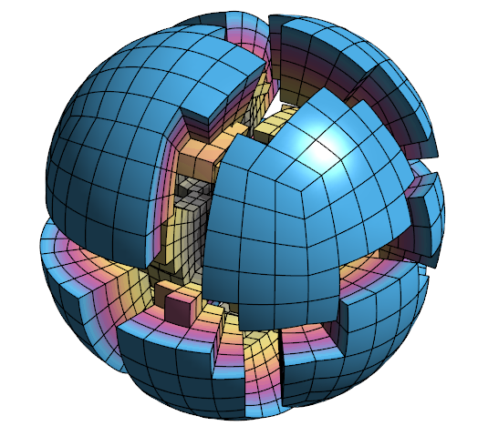
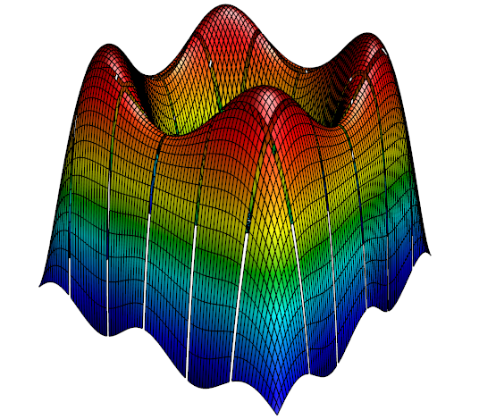

# GLVis Features

The goal of GLVis is to enable research and development of general finite element discretization algorithms through accurate OpenGL visualization, and tight integration with the [MFEM](http://mfem.org) library.

Though depending on MFEM for its finite element dictionary, GLVis can be used independently for parallel and serial visualization. For example, the *[hypre](http://www.llnl.gov/casc/hypre)* library includes scripts for displaying the numerical results from its parallel example codes through GLVis.

## Accurate Visualization

GLVis uses OpenGL with interactive refinement to accurately represent curved high-order [meshes](options-and-use.md#visualizing-meshes) and a wide variety of finite element [grid functions](options-and-use.md#visualizing-functions) defined on them. GLVis is based on the modular finite element methods library [MFEM](http://mfem.org), which supports in particular:

  - 1D, 2D, 3D volume and surface meshes,
  - triangular, quadrilateral, tetrahedral and hexahedral meshes,
  - general [curvilinear](mesh-formats.md) and [NURBS](nurbs.md) meshes,
  - input in unstructured [VTK mesh format](curvilinear-vtk-meshes.md),
  - arbitrary high-order, scalar and vector finite element and NURBS solutions,
  - accurate cutting planes and level lines/surfaces,
  - visualization of parallel meshes and solutions.

## Lightweight and Convenient

GLVis has a fast [keystroke-based](https://raw.githubusercontent.com/glvis/glvis/master/README) interface and uses standard OpenGL that takes advantage of
 hardware acceleration in modern GPUs.
It has a number of convenient features, including:

  - unlimited number of refinement and de-refinement levels,
  - interactive rotation, translation and scaling with the mouse,
  - support for different perspectives, materials, lighting, color schemes and transparency
  - processor and element shrinking for better visualization of the interior of 3D meshes
  - antialiased meshes and fonts,
  - screenshots in PNG or TIFF format,

## Flexible Server and Scripting Support

When started without any options, GLVis [establishes a server](options-and-use.md#server-mode), which waits for socket connections and visualizes any received data in a separate interactive window. This enables:

  - simultaneous visualization of [multiple fields/meshes](http://mfem.org/examples?darcy) in separate GLVis windows,
  - [persistent](http://mfem.org/examples?rk) visualization of time-evolving fields,
  - local visualization of [parallel](parallel-visualization.md) meshes and solutions sent to the server by separate socket connections from each core of a remote parallel machine,
  - saving and displaying of [socket stream data](options-and-use.md#server-mode).

GLVis can also run a [batch sequence](options-and-use.md#glvis-scripts) of commands (GLVis scripts), which enable precise control of particular visualization scenes, and can be useful for making animations.

## Open Source

GLVis is an open-source software, and can be freely used under the terms of the [LGPL 2.1](https://www.gnu.org/licenses/lgpl-2.1.html) license.
