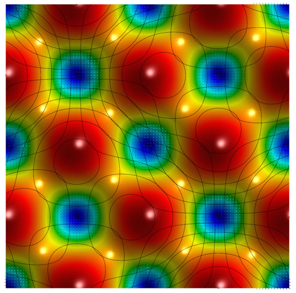
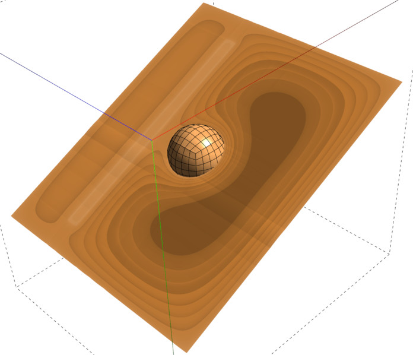

# Gallery

This page collects screenshots from various simulations that have used GLVis visualization. Additional images can be found in the [MFEM Gallery](http://mfem.org/gallery).

 

*The GLVis logo is derived from the [Metatron model](http://www.bathsheba.com/downloads/metatron.zip) at [bathsheba.com](http://www.bathsheba.com). Shown is the magnitude of the projection of a smooth vector field using 4th order Nedelec elements on a second order curved tetrahedral mesh (based on MFEM's [Example 3](http://mfem.github.io/doxygen/html/ex3_8cpp_source.html)).*

----

*Axisymmetric problem with revolved 2D mesh and solution, plus [coloring grid functions](options-and-use.md#visualizing-functions) emphasizing mesh elements.*

----

*Unstructured parallel decomposition of a [fourth order NURBS mesh](https://github.com/mfem/mfem/blob/master/data/ball-nurbs.mesh) of the unit ball obtained in the solution of MFEM's parallel [Example 1](https://github.com/mfem/mfem/blob/master/examples/ex1p.cpp) on 16 processors.*

----

*One of the eight order (Q8) basis functions on the reference square. The sub-refinement in GLVis (key 'i') allows for the correct visualization of such high-order functions.*

*Curvilinear 8th order mesh from a triple-point shock simulation in the MFEM-based  [BLAST](http://www.llnl.gov/casc/blast) shock hydrodynamics code. Click for a movie of the evolution of the processor partitioning from a high-resolution parallel run of the problem produced with a [GLVis script](options-and-use.md#glvis-scripts).*

----

*Level lines in 2D. Simulation with [MFEM](http://mfem.org).*

----

*3D Arbitrary Lagrangian-Eulerian (ALE) simulation of a shock-triple point interaction with Q2-Q1 elements in the MFEM-based [BLAST](http://www.llnl.gov/casc/blast) shock hydrodynamics code. Shown are the cutting plane and level surface capabilities of GLVis.*

----

*Parallel partitioning of a non-conforming adaptively refined mesh between 2048 processors based on splitting a space-filling (Hilbert) curve.*

*The [SIAM CSE13](http://www.siam.org/meetings/cse13) logo illustrates the decomposition of a hexahedral zone in tetrahedral "sides". This and related images can be found in [this paper](http://dx.doi.org/10.1137/100801640).*

----

*The vector field solution of grad-div problem on a periodic mesh computed with hybridized 3rd order Raviart-Thomas elements. Lines correspond to backward Cartesian displacements (key 'd' in GLVis).*

----

*Stitched parallel results from [hypre](http://www.llnl.gov/casc/hypre)'s Example 4 on 36 processors.*

----

*The solution of the Laplace problem on a 3D [NURBS](nurbs.md) mesh. Shown are the solution values in a cutting plane and one of the internal boundaries.*

----

*Locally refined grid in 2D. Simulation with [MFEM](http://mfem.org).*

