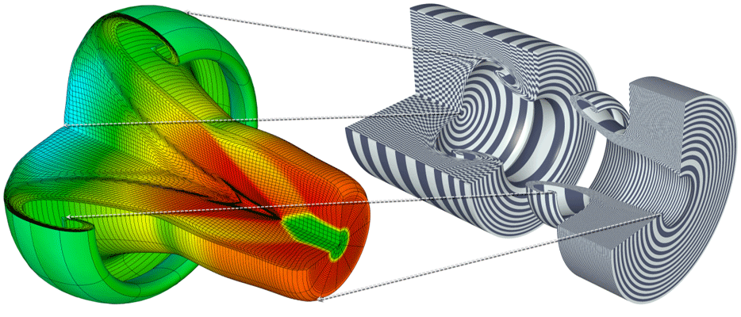
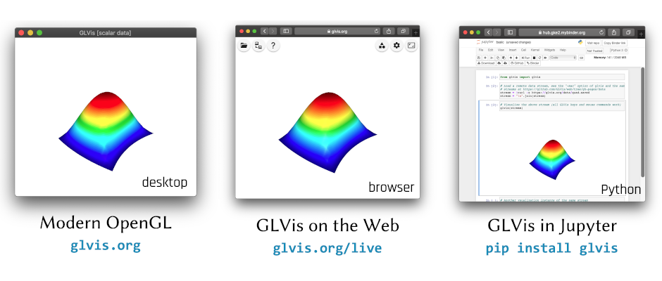
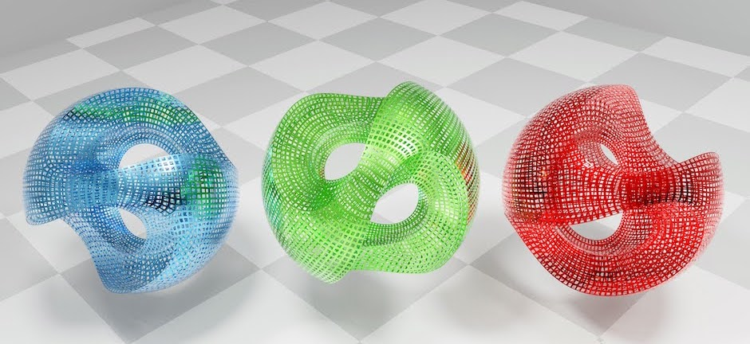

  <!-- Indicators -->
  <ol class="carousel-indicators">
    <li data-target="#myCarousel" data-slide-to="0" class="active"></li>
    <li data-target="#myCarousel" data-slide-to="1"></li>
    <li data-target="#myCarousel" data-slide-to="2"></li>
  </ol>

  <!-- Wrapper for slides -->
  

    

      
    

    

      
      

        Accurate representation of many [finite elements](https://mfem.org/features/#higher-order-finite-element-spaces), support for [arbitrary high-order](mesh-formats.md#curvilinear-and-more-general-meshes) and [NURBS](nurbs.md) meshes
      

    

    

      
      <map name="versionsmap">
        <area shape="rect" coords="11,5,148,132" alt="glvis.org" href="https://glvis.org/download/">
	<area shape="rect" coords="177,4,317,134" alt="glvis.org/live" href="https://glvis.org/live">
	<area shape="rect" coords="345,4,485,136" alt="pip install glvis" href="https://colab.research.google.com/github/GLVis/pyglvis/blob/main/examples/ex1.ipynb">
      </map>
      

        Desktop, [Web](https://glvis.org/live) and [Jupyter](https://colab.research.google.com/github/GLVis/pyglvis/blob/main/examples/ex1.ipynb) versions from the same code base
      

    

    

      
      

        [glTF](https://www.khronos.org/gltf) export to [Blender](https://www.blender.org) and [augmented reality](https://modelviewer.dev/editor) tools
      

    

  

  <!-- Left and right controls -->
  <a class="left carousel-control" href="#myCarousel" data-slide="prev">
    
    Previous
  </a>
  <a class="right carousel-control" href="#myCarousel" data-slide="next">
    
    Next
  </a>

GLVis is a _lightweight_ tool for _accurate_ and _flexible_ finite element visualization.

## Features

 * Accurate functional representation of many [finite elements](https://mfem.org/features/#higher-order-finite-element-spaces).
 * Support for [arbitrary high-order](mesh-formats.md#curvilinear-and-more-general-meshes) and [NURBS](nurbs.md) meshes.
 * Desktop, [Web](https://glvis.org/live) and [Jupyter](https://colab.research.google.com/github/GLVis/pyglvis/blob/main/examples/ex1.ipynb) versions from the same code base.
 * [Server mode](options-and-use.md#server-mode) accepting multiple socket connections.
 * Visualization of [parallel](parallel-visualization.md) meshes and solutions.
 * ... and [many more](features.md).

GLVis is based on the [MFEM](https://mfem.org) library and is used in the [BLAST](http://www.llnl.gov/casc/blast), _[hypre](http://www.llnl.gov/casc/hypre)_ and other projects. See also our [Gallery](gallery.md) and project [news updates](news.md).

## News

Date         | Message
------------ | -----------------------------------------------------------------
Sep 27, 2024 | Version 4.3.2 [released](https://github.com/glvis/glvis/blob/v4.3.2/CHANGELOG).
Jan 20, 2022 | New [FEM@LLNL seminar](https://mfem.org/seminar/) series.
Feb 19, 2021 | Web version at [glvis.org/live](https://glvis.org/live).
Feb 17, 2021 | Jupyter support: [`pip install glvis`](https://github.com/GLVis/pyglvis).

## Latest Release

[New features](https://github.com/glvis/glvis/blob/v4.3.2/CHANGELOG)
┊ [User documentation](https://github.com/glvis/glvis/blob/v4.3.2/README.md)
┊ [Sources](https://github.com/glvis/glvis)

[<button type="button" class="btn btn-success">
**Download glvis-4.3.2.tgz**
</button>](https://bit.ly/glvis-4-3-2)
&nbsp;&nbsp;&nbsp;
[<button type="button" class="btn btn-primary">
**Use web version**
</button>](https://glvis.org/live)

[<i class="fa fa-apple"></i>](https://bit.ly/glvis-mac) [Mac](https://bit.ly/glvis-mac) ┊
[<i class="fa fa-windows"></i>](https://bit.ly/glvis-win) [Windows](https://bit.ly/glvis-win) ┊
[Older releases](download.md) ┊ [glvis.js](https://github.com/glvis/glvis-js) ┊ [pyglvis](https://github.com/glvis/pyglvis)

## Documentation

[Building](building.md)
┊ [Mesh formats](mesh-formats.md)
┊ [Parallel](parallel-visualization.md)
┊ [VTK](curvilinear-vtk-meshes.md)
┊ [NURBS](nurbs.md)

New users should start with the [options and general use](options-and-use.md) tutorial.

We also recommend reading the [MFEM project](https://mfem.org) documentation.

## Contact

Use the GitHub [issue tracker](https://github.com/glvis/glvis/issues)
to report [bugs](https://github.com/glvis/glvis/issues/new?labels=bug)
or post [questions](https://github.com/glvis/glvis/issues/new?labels=question)
or [comments](https://github.com/glvis/glvis/issues/new?labels=comment).
See&nbsp;the [About](about.md) page for citation information.

