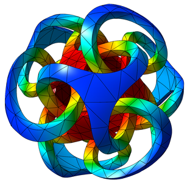

GLVis is a _lightweight_ tool for _accurate_ and _flexible_ finite element visualization.

## Features

 * Accurate representation of a variety of finite element [meshes](mesh-formats.md) and [spaces](http://mfem.org/features/#higher-order-finite-element-spaces).
 * [Server mode](options-and-use.md#server-mode) accepting multiple and/or persistent socket connections.
 * Support for arbitrary high-order [curved](mesh-formats.md#curvilinear-and-more-general-meshes) elements and [NURBS](nurbs.md) meshes.
 * Visualization of [parallel](parallel-visualization.md) meshes and solutions.
 * ... and [many more](features.md).

GLVis is based on the [MFEM](http://mfem.org) library and is currently used in the [BLAST](http://www.llnl.gov/casc/blast), _[hypre](http://www.llnl.gov/casc/hypre)_ and [XBraid](http://www.llnl.gov/casc/xbraid) projects. See also our [Gallery](gallery.md).

## Latest Release

**
[New features](https://raw.githubusercontent.com/glvis/glvis/master/CHANGELOG)
/ [User documentation](https://raw.githubusercontent.com/glvis/glvis/master/README)
/ [Code documentation](http://glvis.github.io/doxygen/html/index.html)
/ [Sources](https://github.com/glvis/glvis)
**

[<button type="button" class="btn btn-success">
**Download glvis-3.0.tgz**
</button>](http://goo.gl/HcdvqY)

For older releases see the [download](download.md) section.

## Documentation

**
[Building](http://mfem.org/building)
/ [Mesh formats](mesh-formats.md)
/ [Parallel visualization](parallel-visualization.md)
/ [VTK](curvilinear-vtk-meshes.md)
/ [NURBS](nurbs.md)
**

The best starting point for new users is the [options and general use](options-and-use.md) tutorial.

We also recommend reading the [MFEM project](http://mfem.org) documentation.

## Contact

Developed by the [GLVis team](about.md) at [CASC](http://computation.llnl.gov/casc/),
[LLNL](https://www.llnl.gov/). Please cite with

    @misc{glvis-tool,
      title = {{GLVis}: Accurate finite element visualization},
      howpublished = {\url{glvis.org}}
    }

Use the GitHub [issue tracker](https://github.com/glvis/glvis/issues)
to report [bugs](https://github.com/glvis/glvis/issues/new?labels=bug)
or post [questions](https://github.com/glvis/glvis/issues/new?labels=question)
or [comments](https://github.com/glvis/glvis/issues/new?labels=comment).

