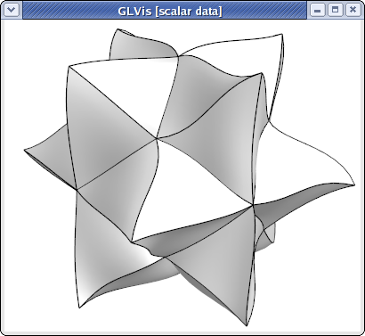
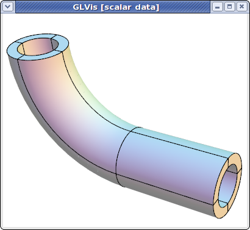

# Mesh Formats

## Summary

Description of the various mesh formats that can be used with GLVis.

## Details

GLVis supports a number of mesh formats, including:

  - The [MFEM](http://mfem.org) mesh v1.0 format, which can describe very general meshes based on any finite element grid function supported by MFEM, including [NURBS meshes](nurbs.md).
  - The [VTK](http://www.vtk.org/) unstructured mesh format, for triangular, quadrilateral, tetrahedral and hexahedral meshes. See the [curvilinear VTK tutorial](curvilinear-vtk-meshes.md) for more details. Some examples of VTK meshes can be found in MFEM's [data directory](https://github.com/mfem/mfem/blob/master/data).
  - The [Gmsh](http://gmsh.info/) ASCII and binary formats for 2D and 3D meshes.
  - The [CUBIT](https://cubit.sandia.gov/) meshes through the Genesis (NetCDF) binary format.
  - The [NETGEN](http://sourceforge.net/projects/netgen-mesher/) triangular and tetrahedral mesh formats.
  - The [TrueGrid](http://www.truegrid.com/) hexahedral mesh format.

### MFEM mesh v1.0

This is the default format in GLVis. It can be used to describe simple (triangular, quadrilateral, tetrahedral and hexahedral meshes with straight edges) or complicated (curvilinear and more general) meshes.

#### Straight meshes

In the simple case of a mesh with straight edges the format looks as follows
```sh
MFEM mesh v1.0

# Space dimension: 2 or 3
dimension
<dimension>

# Mesh elements, e.g. tetrahedrons (4)
elements
<number of elements>
<element attribute> <geometry type> <vertex index 1> ... <vertex index m>
...

# Mesh faces/edges on the boundary, e.g. triangles (2)
boundary
<number of boundary elements>
<boundary element attribute> <geometry type> <vertex index 1> ... <vertex index m>
...

# Vertex coordinates
vertices
<number of vertices>
<vdim>
<coordinate 1> ... <coordinate <vdim>>
...
```

Lines starting with "#" denote comments. The supported geometry types are:

  - POINT       = 0
  - SEGMENT     = 1
  - TRIANGLE    = 2
  - SQUARE      = 3
  - TETRAHEDRON = 4
  - CUBE        = 5

see the comments in [this source file](https://github.com/mfem/mfem/blob/master/fem/geom.hpp) for more details.

For example, the [beam-quad.mesh](https://github.com/mfem/mfem/blob/master/data/beam-quad.mesh) file from MFEM looks like this:
```sh
MFEM mesh v1.0

dimension
2

elements
8
1 3 0 1 10 9
1 3 1 2 11 10
1 3 2 3 12 11
1 3 3 4 13 12
2 3 4 5 14 13
2 3 5 6 15 14
2 3 6 7 16 15
2 3 7 8 17 16

boundary
18
3 1 1 0
3 1 2 1
3 1 3 2
3 1 4 3
3 1 5 4
3 1 6 5
3 1 7 6
3 1 8 7
3 1 9 10
3 1 10 11
3 1 11 12
3 1 12 13
3 1 13 14
3 1 14 15
3 1 15 16
3 1 16 17
1 1 0 9
2 1 17 8

vertices
18
2
0 0
1 0
2 0
3 0
4 0
5 0
6 0
7 0
8 0
0 1
1 1
2 1
3 1
4 1
5 1
6 1
7 1
8 1
```
which corresponds to the mesh


visualized with
```sh
glvis -m beam-quad.mesh -k "Ame****"
```

#### Curvilinear and more general meshes

The MFEM mesh v1.0 format also support the general description of meshes based on a vector finite element grid function with degrees of freedom in the "nodes" of the mesh:
```sh
MFEM mesh v1.0

# Space dimension: 2 or 3
dimension
<dimension>

# Mesh elements, e.g. tetrahedrons (4)
elements
<number of elements>
<element attribute> <geometry type> <vertex index 1> ... <vertex index m>
...

# Mesh faces/edges on the boundary, e.g. triangles (2)
boundary
<number of boundary elements>
<boundary element attribute> <geometry type> <vertex index 1> ... <vertex index m>
...

# Number of vertices (no coordinates)
vertices
<number of vertices>

# Mesh nodes as degrees of freedom of a finite element grid function
nodes
FiniteElementSpace
FiniteElementCollection: <finite element collection>
VDim: <dimension>
Ordering: 0
<x-coordinate degrees of freedom>
...
<y-coordinate degrees of freedom>
...
<z-coordinate degrees of freedom>
...
```
Some possible [finite element collection](https://github.com/mfem/mfem/blob/master/fem/fe_coll.hpp) choices are: `Linear`, `Quadratic` and `Cubic` corresponding to curvilinear P1/Q1, P2/Q2 and P3/Q3 meshes. The algorithm for the numbering of the degrees of freedom can be found in [MFEM's source code](https://github.com/mfem/mfem/blob/v4.7/fem/fespace.cpp#L2374).

For example, the [escher-p3.mesh](https://github.com/mfem/mfem/blob/master/data/escher-p3.mesh) from MFEM's [data directory](https://github.com/mfem/mfem/blob/master/data) describes a tetrahedral mesh with nodes given by a P3 vector Lagrangian finite element function. Visualizing this mesh with
```sh
glvis -m escher-p3.mesh -k "Aaaaoooooooooo**************tt"
```
we get:



#### NURBS meshes

NURBS meshes and functions are fully supported in GLVis. For example,
```sh
glvis -m pipe-nurbs.mesh
```
produces after some refinement (key "`o`") and mouse manipulations



More details about the NURBS mesh format can be found in the separate [NURBS tutorial](nurbs.md).
