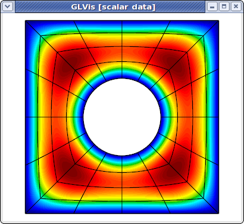

# NURBS Meshes

## Summary

A simple tutorial how to visualize NURBS meshes and solutions with GLVis.

## Details

GLVis provides full support for meshes and discretization spaces based on Non-uniform Rational B-Splines (NURBS). These are treated similarly to general [curvilinear meshes](mesh-formats.md#curvilinear-and-more-general-meshes) where the NURBS nodes are specified as a grid function at the end of the mesh file.

For example, here is a simple quadratic NURBS mesh for a square domain with a (perfectly) circular hole in the middle. (The exact representation of conical sections is a major advantage of the NURBS approach over high-order finite elements.)
```sh
MFEM NURBS mesh v1.0

#
# MFEM Geometry Types (see mesh/geom.hpp):
#
# SEGMENT     = 1
# SQUARE      = 3
# CUBE        = 5
#

dimension
2

elements
4
1 3 0 1 5 4
1 3 1 2 6 5
1 3 2 3 7 6
1 3 3 0 4 7

boundary
8
1 1 0 1
1 1 1 2
1 1 2 3
1 1 3 0
1 1 5 4
1 1 6 5
1 1 7 6
1 1 4 7

edges
12
0 0 1
0 4 5
1 1 2
1 5 6
2 2 3
2 6 7
3 3 0
3 7 4
4 0 4
4 1 5
4 2 6
4 3 7

vertices
8

knotvectors
5
2  3 0 0 0 1 1 1
2  3 0 0 0 1 1 1
2  3 0 0 0 1 1 1
2  3 0 0 0 1 1 1
2  3 0 0 0 1 1 1

weights
1
1
1
1
1
1
1
1
1
0.707106781
1
0.707106781
1
0.707106781
1
0.707106781
1
1
1
1
0.853553391
0.853553391
0.853553391
0.853553391

FiniteElementSpace
FiniteElementCollection: NURBS2
VDim: 2
Ordering: 1

0 0
1 0
1 1
0 1
0.358578644 0.358578644
0.641421356 0.358578644
0.641421356 0.641421356
0.358578644 0.641421356
0.5 0
0.5 0.217157288
1 0.5
0.782842712 0.5
0.5 1
0.5 0.782842712
0 0.5
0.217157288 0.5
0.15 0.15
0.85 0.15
0.85 0.85
0.15 0.85
0.5  0.108578644
0.891421356 0.5
0.5 0.891421356
0.108578644 0.5
```
This above file, as well as other examples of NURBS meshes, can be found in [MFEM's data directory](https://github.com/mfem/mfem/tree/master/data). It can be visualized directly with
```sh
glvis -m square-disc-nurbs.mesh
```
which after pressing "`e`", "`m`", "`A`", and several refinements with the "`o`" key looks like


To explain MFEM's NURBS mesh file format, we first note that the topological part of the mesh (the `elements` and `boundary` sections) describe the 4 NURBS patches visible above. We use the vertex numbers as labels, so we only need the number of vertices.

In the NURBS case we need to also provide description of the edges on the patch boundaries and associate a knot vector with each of them. This is done in the `edges` section where the first index in each row refers to the knot vector id (from the following `knotvectors` section), while the remaining two indexes are the edge vertex numbers.

The position of the NURBS nodes (control points) is given as a NURBS grid function at the end of the file, while the associated weights are listed in the preceding `weights` section.

Solutions from NURBS discretization spaces are also natively supported. For example here is the approximation for the solution of a simple Poisson problem on a refined version of the above mesh.
```sh
glvis -m square-disc-nurbs.mesh -g sol.gf
```


