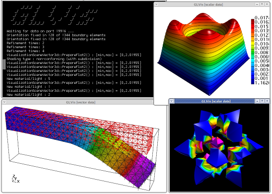
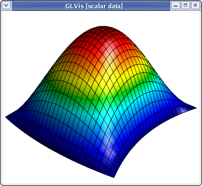
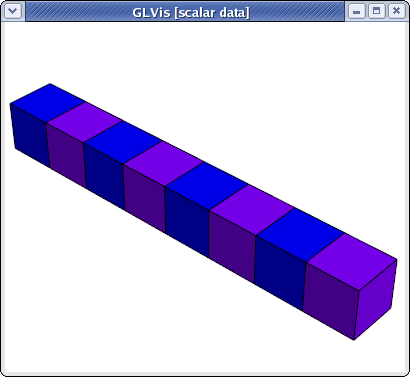
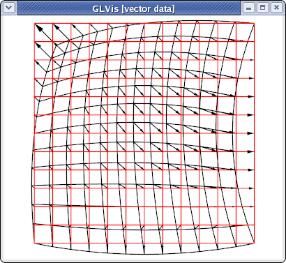
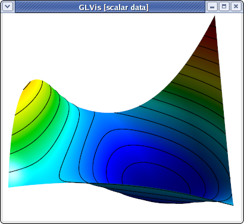
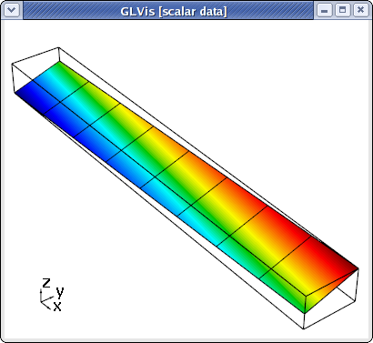

# Options and Use

## Quick start

  - Start a socket server: **`glvis`**
  - View a mesh: **`glvis -m star.mesh`**
  - View a mesh with a finite element grid function: **`glvis -m star.mesh -g sol.gf`**
  - View mesh and solution from a run on 4 processors: **`glvis -np 4 -m mesh -g sol`** (assuming data saved in files: `mesh.000000`, ... , `mesh.000003` and `sol.000000`, ...  , `sol.000003`)
  - Use **`glvis -h`** to get help on all command line options.
  - See [README](https://raw.githubusercontent.com/glvis/glvis/master/README) for a detail of the keystroke commands accepted in the GLVis interactive window.

Some of the command-line options of GLVis and its general use are described in more details below:

  - [The GLVis server mode](#server-mode)
  - [How to visualize meshes](#visualizing-meshes)
  - [How to visualize functions](#visualizing-functions)
  - [GLVis scripts](#glvis-scripts)

## Details

GLVis has a number of command-line options that allow it to be used in several different ways. The list of all available options is given by the output of "`glvis -h`":

```tex
       _/_/_/  _/      _/      _/  _/
    _/        _/      _/      _/        _/_/_/
   _/  _/_/  _/      _/      _/  _/  _/_/
  _/    _/  _/        _/  _/    _/      _/_/
   _/_/_/  _/_/_/_/    _/      _/  _/_/_/

Start a GLVis server:
   glvis
Visualize a mesh:
   glvis -m <mesh_file>
Visualize mesh and solution (grid function):
   glvis -m <mesh_file> -g <grid_function_file> [<component>](-gc)
Visualize parallel mesh and solution (grid function):
   glvis -np <#proc> -m <mesh_prefix> [<grid_function_prefix>](-g)

All Options:
   -h, --help
    Print this help message and exit.
   -m <string>, --mesh <string>, current value: (none)
    Mesh file to visualize.
   -g <string>, --grid-function <string>, current value: (none)
    Solution (GridFunction) file to visualize.
   -gc <int>, --grid-function-component <int>, current value: -1
    Select a grid function component, [or -1 for all.
   -s <string>, --scalar-solution <string>, current value: (none)
    Scalar solution (vertex values) file to visualize.
   -v <string>, --vector-solution <string>, current value: (none)
    Vector solution (vertex values) file to visualize.
   -np <int>, --num-proc <int>, current value: 0
    Load mesh/solution from multiple processors.
   -run <string>, --run-script <string>, current value: (none)
    Run a GLVis script file.
   -k <string>, --keys <string>, current value: (none)
    Execute key shortcut commands in the GLVis window.
   -fo, --fix-orientations, -no-fo, --dont-fix-orientations, current option: --dont-fix-orientations
    Attempt to fix the orientations of inverted elements.
   -a, --real-attributes, -ap, --processor-attributes, current option: --processor-attributes
    When opening a parallel mesh, use the real mesh attributes or replace them with the processor rank.
   -sc, --save-coloring, -no-sc, --dont-save-coloring, current option: --dont-save-coloring
    Save the mesh coloring generated when opening only a mesh.
   -p <int>, --listen-port <int>, current value: 19916
    Specify the port number on which to accept connections.
   -mac, --save-stream, -no-mac, --dont-save-stream, current option: --dont-save-stream
    In server mode, save incoming data to a file before visualization.
   -saved <string>, --saved-stream <string>, current value: (none)
    Load a GLVis stream saved to a file.
   -ww <int>, --window-width <int>, current value: 400
    Set the window width.
   -wh <int>, --window-height <int>, current value: 350
    Set the window height.
   -wt <string>, --window-title <string>, current value: (default)
    Set the window title.
   -fn <string>, --font <string>, current value: (default)
    Set the font: <font-name>[-<font-size>](0-<num-comp>)).
   -ms <int>, --multisample <int>, current value: 4
    Set the multisampling mode (toggled with the 'A' key).
   -lw <double>, --line-width <double>, current value: 1
    Set the line width (multisampling off).
   -mslw <double>, --multisample-line-width <double>, current value: 1.4
    Set the line width (multisampling on).
```

### Server mode

GLVis can be used as a visualization server, where it waits for data sent by socket connections from applications and visualizes each socket stream in a separate interactive window:



To establish the GLVis server, open a new terminal and start the GLVis application without any options:
```sh
glvis
```
By default, the server is established on [port 19916](https://github.com/glvis/glvis/blob/master/glvis.cpp#L1007), but this can be changed with the "`-p`" option.

On legacy Mac machines with OS X Leopard, the server needs to be started with
```sh
glvis -mac
```
This is due to the fact that Mac OS X returns an error when [fork() is called without an immediate exec()](http://developer.apple.com/library/mac/#technotes/tn2083/_index.html#//apple_ref/doc/uid/DTS10003794-CH1-SUBSUBSECTION66). *Note that this option is not necessary on newer versions of OS X.*

A side effect of the "`-mac`" option is that all socket streams will be saved in incrementally named files "`glvis-saved.0001`", "`glvis-saved.0002`", and so on. These socket files consist of a [data type identifier](https://github.com/glvis/glvis/blob/master/glvis.cpp#L104) followed by a mesh and a finite element function. For example:
```sh
fem2d_gf_data

MFEM mesh v1.0

dimension
2

elements
1
1 3 0 1 2 3

boundary
4
1 1 1 0
1 1 2 1
1 1 3 2
1 1 0 3

vertices
4

nodes
FiniteElementSpace
FiniteElementCollection: Quadratic
VDim: 2
Ordering: 0

0
1
1
0.1
0.5
0.9
0.5
0
0.45
0
0
1
0.9
-0.05
0.5
1
0.5
0.55

FiniteElementSpace
FiniteElementCollection: Quadratic
VDim: 1
Ordering: 0

0
0
0
0
0
0
0
0
1
```
Note that the mesh portion of the above file is the MFEM mesh v1.0 version of the quad.vtk mesh from the [curvilinear VTK tutorial](curvilinear-vtk-meshes.md).

The "`*.saved`" files contain an *exact copy* of the socket data stream which can be visualized later as follows:
```sh
glvis -saved glvis-saved.0001
```

Below is the result for the above socket data using the following GLVis keystrokes in the OpenGL window: "`AmttII`" followed by multiple refinements with "`i`" and move/zoom adjustments with the mouse.



### Visualizing meshes

GLVis can also be employed in non-sever mode, e.g. to visualize a mesh file:
```sh
glvis -m quad.vtk
```
The optional "`-k`" parameter specifies a set of keystrokes, which will be passed directly to the GLVis window, see, e.g., the examples in the [mesh formats tutorial](mesh-formats.md).

Two dimensional meshes are shown with elements in multiple colors, corresponding to a piece-wise constant function with different values in neighboring elements. This function can be generated and saved with the "`-sc`" option, which writes it in a file called "`GLVis_coloring.gf`".

### Visualizing functions

There are several ways to visualize a function on a given mesh. For example we can visualize the coloring function for the mesh [beam-hex.mesh](https://github.com/mfem/mfem/blob/master/data/beam-hex.mesh) as follows:
```sh
glvis -m beam-hex.mesh -sc
glvis -m beam-hex.mesh -g GLVis_coloring.gf
```
The result is:



As another example, consider the finite element grid function "`quad.gf`" embedded in the socket stream "`glvis-saved.0001`" discussed above:
```sh
FiniteElementSpace
FiniteElementCollection: Quadratic
VDim: 1
Ordering: 0

0
0
0
0
0
0
0
0
1
```
Then
```sh
glvis -m quad.vtk -g quad.gf
```
will produce identical result to "`glvis -saved glvis-saved.0001`".

Vector-valued grid functions are also supported. For example, consider the following data saved in a file named "`quad-vec.gf`"
```sh
FiniteElementSpace
FiniteElementCollection: Quadratic
VDim: 2
Ordering: 0

0
0
0
-0.1
0
0.1
0
0
0.05

0
0
0
0.1
0.05
0
0
0
-0.05
```
which corresponds to the Q2 vector field transforming the "`quad.vtk`" quadrilateral into the unit square:



The above plot was produced with:
```sh
glvis -m quad.vtk -g quad-vec.gf -k "fRjlAmeIIiiiiiiiiiiibbvuuuuuuuuuuu"
```
The transformation between the two domains can be further explored with the "`b`" and "`n`" keys.

One can also visualize the different components of a vector field as scalar functions using the "`-gc`" option, e.g.
```sh
glvis -m quad.vtk -g quad-vec.gf -gc 1
```
gives after some manipulations the following plot:



Finally, GLVis supports the visualization of functions with values provided only in the vertices of the mesh. *This is only supported for non-curved meshes!* The scalar and vector case are handled by the "`-s`" and "`-v`" options respectively. Here is an example with the [beam-quad.mesh](https://github.com/mfem/mfem/blob/master/data/beam-quad.mesh) mesh file and a solution saved in a file "`beam-quad.sol`":
```sh
solution
1
2
3
4
5
6
7
8
9
10
11
12
13
14
15
16
17
18
```
```sh
glvis -m beam-quad.mesh -s beam-quad.sol -k "Amaa"
```



Note that the data in this type of solution files starts from the second line (the first line contains an identifier). The vector format for the "`-v`" option is similar, with all the x-components of the field listed first, followed by all the y-components, etc.

### GLVis scripts

GLVis can also run a batch sequence of commands, called GLVis scripts, which are useful for saving particular visualization scenes, as well as to generate still frames for animations. 

Scripts are executed with `glvis -run`. For example, consider the following script, saved in a file "`quad-vec.glvs`":
```sh
# Visualization window geometry
window 0 0 300 300

# Initial solution
solution quad.vtk quad-vec.gf

# Setup the GLVis scene. Executed after pressing the space bar.
{
   perspective off
   view 0 0
   viewcenter 0 0
   zoom 1.95
   keys fAmeIIiiiiiiiiiiibbvuuuuuuuuuuu
}

# Take multiple screenshots. Executed after pressing the space bar.
{
   keys b
   solution quad.vtk quad-vec.gf screenshot quad-vec.00.png
   keys b
   solution quad.vtk quad-vec.gf screenshot quad-vec.01.png
   keys b
   solution quad.vtk quad-vec.gf screenshot quad-vec.02.png
   keys b
   solution quad.vtk quad-vec.gf screenshot quad-vec.03.png
   keys b
   solution quad.vtk quad-vec.gf screenshot quad-vec.04.png
   keys b
   solution quad.vtk quad-vec.gf screenshot quad-vec.05.png
   keys b
   solution quad.vtk quad-vec.gf screenshot quad-vec.06.png
   keys b
   solution quad.vtk quad-vec.gf screenshot quad-vec.07.png
   keys b
   solution quad.vtk quad-vec.gf screenshot quad-vec.08.png
   keys b
   solution quad.vtk quad-vec.gf screenshot quad-vec.09.png
   keys b
   solution quad.vtk quad-vec.gf screenshot quad-vec.10.png
}
```
The "`#`" lines above indicate comments, while the braces separate the different sequences of commands that are executed together. GLVis will pause between these execution blocks, waiting for the user to press the space bar in order to continue. The "`solution`" command above updates the mesh and the finite element function plotted, without changing any other visualization parameters, while "`screenshot`" uses [xwd](http://www.xfree86.org/current/xwd.1.html) or the [TIFF library](http://www.libtiff.org/) together with [ImageMagick's convert utility](http://www.imagemagick.org/script/convert.php) to save a picture in the specified format. There are a number of additional script commands available, the complete list of which can be found (and extended) by examining the [glvis.cpp source code](https://github.com/glvis/glvis/blob/master/glvis.cpp#L563).

Executing
```sh
glvis -run quad-vec.glvs
```
and pressing the space bar twice in the GLVis window generates a sequence of screenshots, which can be animated, e.g., with
```sh
convert -delay 20 quad-vec.??.png quad-vec.gif
```
The generated animated GIF file is shown below (you may need to reload the page to see the animation):


More examples of animations produced with GLVis scripts can be found at the [BLAST website](https://computation.llnl.gov/casc/blast), e.g., [here](https://computation.llnl.gov/casc/blast/triple-pt/triple-pt-xy.gif) and [here](https://computation.llnl.gov/casc/blast/triple-pt/triple-pt-rz.gif).
