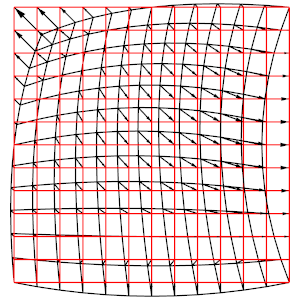

# Options and Use

## Quick start

  - Start a socket server: `glvis`
  - View a mesh: `glvis -m star.mesh`
  - View a mesh with a finite element grid function:
  `glvis -m star.mesh -g sol.gf`
  - View mesh and solution from a run on 4 processors:
  `glvis -np 4 -m mesh -g sol` (assuming data saved in files: `mesh.000000`,
  ... , `mesh.000003` and `sol.000000`, ...  , `sol.000003`)
  - Use `glvis -h` to get help on all command line options.
  - See [README.md](https://github.com/glvis/glvis/blob/master/README.md#key-commands)
  for a detailed description of the keystroke commands accepted in the GLVis interactive
  window.

Some of the command-line options of GLVis and its general use are described in
more details below:

  - [The GLVis server mode](#server-mode)
  - [How to visualize meshes](#visualizing-meshes)
  - [How to visualize functions](#visualizing-functions)
  - [GLVis scripts](#glvis-scripts)

## Options

GLVis has a number of command-line options that allow it to be used in several
different ways. The list of all available options is given by the output of
`glvis -h`:

```text
       _/_/_/  _/      _/      _/  _/
    _/        _/      _/      _/        _/_/_/
   _/  _/_/  _/      _/      _/  _/  _/_/
  _/    _/  _/        _/  _/    _/      _/_/
   _/_/_/  _/_/_/_/    _/      _/  _/_/_/

Start a GLVis server:
   glvis
Visualize a mesh:
   glvis -m <mesh_file>
Visualize mesh and solution (grid function):
   glvis -m <mesh_file> -g <grid_function_file> [-gc <component>]
Visualize parallel mesh and solution (grid function):
   glvis -np <#proc> -m <mesh_prefix> [-g <grid_function_prefix>]
Visualize mesh and quadrature function:
   glvis -m <mesh_file> -q <quadrature_function_file> [-qc <component>]
Visualize parallel mesh and quadrature function:
   glvis -np <#proc> -m <mesh_prefix> [-q <quadrature_function_prefix>]

All Options:
   -h, --help
        Print this help message and exit.
   -m <string>, --mesh <string>, current value: (none)
        Mesh file to visualize.
   -g <string>, --grid-function <string>, current value: (none)
        Solution (GridFunction) file to visualize.
   -gc <int>, --grid-function-component <int>, current value: -1
        Select a grid function component, [0-<num-comp>) or -1 for all.
   -q <string>, --quadrature-function <string>, current value: (none)
        Quadrature function file to visualize.
   -qc <int>, --quadrature-function-component <int>, current value: -1
        Select a quadrature function component, [0-<num-comp>) or -1 for all.
   -s <string>, --scalar-solution <string>, current value: (none)
        Scalar solution (vertex values) file to visualize.
   -v <string>, --vector-solution <string>, current value: (none)
        Vector solution (vertex values) file to visualize.
   -visit <string>, --visit-datafiles <string>, current value: (none)
        VisIt collection to load
   -sidre <string>, --sidre-datafiles <string>, current value: (none)
        Sidre collection to load
   -fms <string>, --fms-datafiles <string>, current value: (none)
        FMS collection to load
   -conduit <string>, --conduit-datafiles <string>, current value: (none)
        Conduit collection to load
   -dc-prot <string>, --data-collection-protocol <string>, current value: (default)
        Protocol of the data collection to load
   -dc-cycle <int>, --data-collection-cycle <int>, current value: 0
        Cycle of the data collection to load
   -np <int>, --num-proc <int>, current value: 0
        Load mesh/solution from multiple processors.
   -d <int>, --pad-digits <int>, current value: 6
        Number of digits used for processor ranks in file names.
   -run <string>, --run-script <string>, current value: (none)
        Run a GLVis script file.
   -k <string>, --keys <string>, current value: (none)
        Execute key shortcut commands in the GLVis window.
   -pal <string>, --palettes <string>, current value: (none)
        Palette file.
   -fo, --fix-orientations, -no-fo, --dont-fix-orientations, current option: --dont-fix-orientations
        Attempt to fix the orientations of inverted elements.
   -a, --real-attributes, -ap, --processor-attributes, current option: --processor-attributes
        When opening a parallel mesh, use the real mesh attributes or replace them with the processor rank.
   -grt <int>, --geometry-refiner-type <int>, current value: 3
        Set of points to use when refining geometry: 3 = uniform, 1 = Gauss-Lobatto, (see mfem::Quadrature1D).
   -sc, --save-coloring, -no-sc, --dont-save-coloring, current option: --dont-save-coloring
        Save the mesh coloring generated when opening only a mesh.
   -p <int>, --listen-port <int>, current value: 19916
        Specify the port number on which to accept connections.
   -sec, --secure-sockets, -no-sec, --standard-sockets, current option: --standard-sockets
        Enable or disable GnuTLS secure sockets.
   -save, --save-stream, -no-save, --dont-save-stream, current option: --dont-save-stream
        In server mode, save incoming data to a file before visualization.
   -saved <string>, --saved-stream <string>, current value: (none)
        Load a GLVis stream saved to a file.
   -ww <int>, --window-width <int>, current value: 400
        Set the window width.
   -wh <int>, --window-height <int>, current value: 350
        Set the window height.
   -wt <string>, --window-title <string>, current value: (default)
        Set the window title.
   -c <string>, --plot-caption <string>, current value: (none)
        Set the plot caption (visible when colorbar is visible).
   -fn <string>, --font <string>, current value: (default)
        Set the font: [<font-name>[:style=<style>]][-<font-size>], e.g. -fn "Helvetica:style=Bold-16".
   -ms <int>, --multisample <int>, current value: 4
        Set the multisampling mode (toggled with the 'A' key).
   -lw <double>, --line-width <double>, current value: 1
        Set the line width (multisampling off).
   -mslw <double>, --multisample-line-width <double>, current value: 1
        Set the line width (multisampling on).
   -oldgl, --legacy-gl, -anygl, --any-gl, current option: --any-gl
        Only try to create a legacy OpenGL (< 2.1) context.
   -hidpi, --high-dpi, -nohidpi, --no-high-dpi, current option: --high-dpi
        Enable/disable support for HiDPI at runtime, if supported.
```

## Server mode

GLVis can be used as a visualization server, where it waits for data sent by
socket connections from applications and visualizes each socket stream in a
separate interactive window:


To establish the GLVis server, open a new terminal and start the GLVis
application without any options:
```sh
glvis
```
By default, the server is established on
[port 19916](https://github.com/glvis/glvis/blob/v4.4/glvis.cpp#L1421), but
this can be changed with the `-p` option.

<!--
On legacy Mac machines with OS X Leopard, the server needs to be started with
```sh
glvis -save
```
This is due to the fact that Mac OS X returns an error when [fork() is called
without an immediate exec()](http://developer.apple.com/library/mac/#technotes/tn2083/_index.html#//apple_ref/doc/uid/DTS10003794-CH1-SUBSUBSECTION66).
*Note that this option is not necessary on newer versions of OS X.*
-->

To save the incoming data, the server needs to be started with
```sh
glvis -save
```
With the `-save` option, all socket streams will be saved in
incrementally named files `glvis-saved.0001`, `glvis-saved.0002`, and so on.
These socket files consist of a data type identifier:
`mesh`, `solution`, `psolution`, `quadrature` or `pquadrature`,
followed by a mesh and a finite element function. For example:
```sh
solution

MFEM mesh v1.0

dimension
2

elements
1
1 3 0 1 2 3

boundary
4
1 1 1 0
1 1 2 1
1 1 3 2
1 1 0 3

vertices
4

nodes
FiniteElementSpace
FiniteElementCollection: Quadratic
VDim: 2
Ordering: 0

0
1
1
0.1
0.5
0.9
0.5
0
0.45
0
0
1
0.9
-0.05
0.5
1
0.5
0.55

FiniteElementSpace
FiniteElementCollection: Quadratic
VDim: 1
Ordering: 0

0
0
0
0
0
0
0
0
1
```
Note that the mesh portion of the above file is the MFEM mesh v1.0 version of
the quad.vtk mesh from the [curvilinear VTK tutorial](curvilinear-vtk-meshes.md).

The `*.saved` files contain an *exact copy* of the socket data stream which can
be visualized later as follows:
```text
glvis -saved glvis-saved.0001
```

Below is the result for the above socket data using the following GLVis
keystrokes in the OpenGL window: <kbd>AmttOO</kbd> followed by multiple refinements with
<kbd>o</kbd> and move/zoom adjustments with the mouse.


There are many additional stream commands, which can be used. Their complete
list is here:
```text
mesh <mesh> - Visualize the mesh.
solution <mesh> <solution> - Visualize the solution.
quadrature <mesh> <quadrature> - Visualize the quadrature.
fem2d_data <mesh> <data> - Visualize the 2D scalar data.
vfem2d_data <mesh> <data_x> <data_y> - Visualize the 2D vector data.
vfem2d_data_keys <mesh> <data_x> <data_y> <keys> - Visualize the 2D vector data and apply control keys.
fem3d_data <mesh> <data> - Visualize the 3D scalar data.
vfem3d_data <mesh> <data_x> <data_y> <data_z> - Visualize the 3D vector data.
vfem3d_data_keys <mesh> <data_x> <data_y> <data_z> <keys> - Visualize the 3D vector data and apply control keys.
fem2d_gf_data <mesh> <solution> - Visualize the 2D scalar grid function.
fem2d_gf_data_keys <mesh> <solution> <keys> - Visualize the 2D scalar grid function and apply control keys.
vfem2d_gf_data <mesh> <solution> - Visualize the 2D vector grid function.
vfem2d_gf_data_keys <mesh> <solution> <keys> - Visualize the 2D vector grid function and apply control keys.
fem3d_gf_data <mesh> <solution> - Visualize the 3D scalar grid function.
fem3d_gf_data_keys <mesh> <solution> <keys> - Visualize the 3D scalar grid function and apply control keys.
vfem3d_gf_data <mesh> <solution> - Visualize the 3D vector grid function.
vfem3d_gf_data_keys <mesh> <solution> <keys> - Visualize the 3D vector grid function and apply control keys.
raw_scalar_2d <data> - Visualize the 2D scalar data (see stream_reader.cpp).
parallel <num proc> <proc> - Prefix for distributed mesh/solution/quadrature.
screenshot <file> - Take a screenshot, saving it to the file.
viewcenter <x> <y> - Change the viewcenter.
view <theta> <phi> - Change the solid angle of view.
zoom <zoom> - Change the zoom factor.
shading <flat/smooth/cool> - Change the shading algorithm.
subdivisions <times> <dummy> - Change the refinement level.
valuerange <min> <max> - Change the value range.
autoscale <off/on/value/mesh> - Change the autoscale algorithm.
levellines <min> <max> <num> - Set the level lines.
axis_numberformat '<format>' - Set the axis number format.
colorbar_numberformat '<format>' - Set the colorbar number format.
window_size <w> <h> - Set the size of the window.
window_geometry <x> <y> <w> <h> - Set the position and size of the window.
window_title '<title>' - Set title of the window.
keys <keys> - Send the control key sequence.
palette <index> - Set the palette index.
palette_repeat <times> - Set the repetition of the palette.
camera <cam[0]> ... <cam[2]> <dir[0]> ... <dir[2]> <up[0]> ... <up[2]> - Set the camera position, direction and upward vector.
plot_caption '<caption>' - Set the plot caption.
axis_labels '<x label>' '<y label>' '<z label>' - Set labels of the axes.
pause  - Stop the stream until space is pressed.
autopause <0/off/1/on> - Turns off or on autopause.
```

## Visualizing meshes

GLVis can also be employed in non-sever mode, e.g. to visualize a mesh file:
```sh
glvis -m quad.vtk
```
The optional `-k` parameter specifies a set of keystrokes, which will be passed
directly to the GLVis window, see, e.g., the examples in the
[mesh formats tutorial](mesh-formats.md).

Two dimensional meshes are shown with elements in multiple colors, corresponding
to a piece-wise constant function with different values in neighboring elements.
This function can be generated and saved with the `-sc` option, which writes it
in a file called `GLVis_coloring.gf`.

Alternatively, the mesh can be loaded from a data collection (VisIt, Sidre, FMS,
or Conduit). Path to the collection is provided through the respective command
line parameter (`-visit`, `-sidre`, `-fms` or `-conduit`). Optionally, the
cycle and protocol can be set by `-dc-cycle` and `-dc-prot` parameters.

## Visualizing functions

There are several ways to visualize a function on a given mesh. For example we
can visualize the coloring function for the mesh
[beam-hex.mesh](https://github.com/mfem/mfem/blob/master/data/beam-hex.mesh) as
follows:
```sh
glvis -m beam-hex.mesh -sc
glvis -m beam-hex.mesh -g GLVis_coloring.gf
```
The result is:


As another example, consider the finite element grid function `quad.gf` embedded
in the socket stream `glvis-saved.0001` discussed above:
```sh
FiniteElementSpace
FiniteElementCollection: Quadratic
VDim: 1
Ordering: 0

0
0
0
0
0
0
0
0
1
```
Then
```sh
glvis -m quad.vtk -g quad.gf
```
will produce identical result to `glvis -saved glvis-saved.0001`.

Vector-valued grid functions are also supported. For example, consider the
following data saved in a file named `quad-vec.gf`
```sh
FiniteElementSpace
FiniteElementCollection: Quadratic
VDim: 2
Ordering: 0

0
0
0
-0.1
0
0.1
0
0
0.05

0
0
0
0.1
0.05
0
0
0
-0.05
```
which corresponds to the Q2 vector field transforming the `quad.vtk`
quadrilateral into the unit square:


The above plot was produced with:
```sh
glvis -m quad.vtk -g quad-vec.gf -k "RjlAmeOOooooooooooobbvuuuuuuuuuuu************"
```
The transformation between the two domains can be further explored with the <kbd>b</kbd>
and <kbd>n</kbd> keys.

One can also visualize the different components of a vector field as scalar
functions using the `-gc` option, e.g.
```text
glvis -m quad.vtk -g quad-vec.gf -gc 1
```
gives after some manipulations the following plot:


Moreover, GLVis supports the visualization of functions with values provided only
in the vertices of the mesh. *This is only supported for non-curved meshes!* The
scalar and vector case are handled by the `-s` and `-v` options respectively.
Here is an example with the
[beam-quad.mesh](https://github.com/mfem/mfem/blob/master/data/beam-quad.mesh)
mesh file and a solution saved in a file `beam-quad.sol`:
```sh
solution
1
2
3
4
5
6
7
8
9
10
11
12
13
14
15
16
17
18
```
```sh
glvis -m beam-quad.mesh -s beam-quad.sol -k "Amaa"
```


Note that the data in this type of solution files starts from the second line
(the first line contains an identifier). The vector format for the `-v` option
is similar, with all the x-components of the field listed first, followed by
all the y-components, etc.

Finally, the function can be loaded from a data collection. Start with loading
the collection as for [visualization of meshes](#visualizing-meshes) and
specify name of the field through the `-g` parameter.

## Visualizing quadrature data

GLVis can also visualize quadrature data (`QuadratureFunction` in MFEM). As an
example, we may modify the Laplace problem from [Example 1](https://mfem.org/examples/#ex1)
in MFEM to produce the following quadrature data for linear elements on
[data/star-q2.mesh](https://github.com/mfem/mfem/blob/master/data/star-q2.mesh)
mesh:
```sh
QuadratureSpace
Type: default_quadrature
Order: 2
VDim: 1

0.31230931
0.26439977
0.26899615
0.21618069
0.31395881
0.26847144
0.27055581
0.21422246
0.31382331
0.27104673
0.26796573
0.21605458
0.3123637
0.26757589
0.26559942
0.21459966
0.31153282
0.26609827
0.26447499
0.21646139
0.19469524
0.052168431
0.15524982
0.041599065
0.11105477
0.029757035
0.029757035
0.0079733734
0.19964714
0.15657668
0.05349529
0.041954596
0.19860568
0.053216231
0.15268989
0.040913132
0.10716797
0.028715571
0.028715571
0.0076943141
0.20085128
0.15329159
0.053817938
0.041074359
0.20141928
0.053970134
0.15541141
0.041642362
0.10928779
0.029283575
0.029283575
0.0078465102
0.19809997
0.154522
0.053080726
0.041404046
0.19810132
0.053081088
0.15452705
0.041405398
0.10929283
0.029284927
0.029284927
0.0078468725
0.19597197
0.15395649
0.052510531
0.041252518
0.19674926
0.052718805
0.15685739
0.04202981
0.11219373
0.030062219
0.030062219
0.0080551473
0.19500042
0.15638879
0.052250205
0.041904249
```

Saving the example as `star.qf`, this quadrature data can be then visualized
by the following command (assuming a link to `star-q2.mesh` is in the directory):
```sh
./glvis -m star-q2.mesh -q star.qf
```
This produces the following different representations of the quadrature data,
which can be switched by pressing the <kbd>Q</kbd> key:

| LOR |  Interpolation |  Projection |
| --- | -------------- | ----------- |
|  |  |  |

Finally, loading of quadratures from data collections is supported. Start with
loading the collection as for [visualization of meshes](#visualizing-meshes)
and specify name of the Q-field through the `-q` parameter. 

## GLVis scripts

GLVis can also run a batch sequence of commands, called GLVis scripts, which
are useful for saving particular visualization scenes, as well as to generate
still frames for animations.

Scripts are executed with `glvis -run`. For example, consider the following
script, saved in a file `quad-vec.glvs`:
```sh
# Visualization window geometry
window 0 0 300 300

# Initial solution
solution quad.vtk quad-vec.gf

# Setup the GLVis scene. Executed after pressing the space bar.
{
   perspective off
   view 0 0
   viewcenter 0 0
   zoom 1.95
   keys AmeOOooooooooooobbvuuuuuuuuuuu
}

# Take multiple screenshots. Executed after pressing the space bar.
{
   keys b
   solution quad.vtk quad-vec.gf screenshot quad-vec.00.png
   keys b
   solution quad.vtk quad-vec.gf screenshot quad-vec.01.png
   keys b
   solution quad.vtk quad-vec.gf screenshot quad-vec.02.png
   keys b
   solution quad.vtk quad-vec.gf screenshot quad-vec.03.png
   keys b
   solution quad.vtk quad-vec.gf screenshot quad-vec.04.png
   keys b
   solution quad.vtk quad-vec.gf screenshot quad-vec.05.png
   keys b
   solution quad.vtk quad-vec.gf screenshot quad-vec.06.png
   keys b
   solution quad.vtk quad-vec.gf screenshot quad-vec.07.png
   keys b
   solution quad.vtk quad-vec.gf screenshot quad-vec.08.png
   keys b
   solution quad.vtk quad-vec.gf screenshot quad-vec.09.png
   keys b
   solution quad.vtk quad-vec.gf screenshot quad-vec.10.png
}
```
The `#` lines above indicate comments, while the braces separate the different
sequences of commands that are executed together. GLVis will pause between these
execution blocks, waiting for the user to press the space bar in order to
continue. The `solution` command above updates the mesh and the finite element
function plotted, without changing any other visualization parameters, while
`screenshot` uses [libpng](http://libpng.org) (or
[LibTIFF](http://www.libtiff.org/), or
[xwd](http://www.xfree86.org/current/xwd.1.html) depending on the build
configuration) with
[ImageMagick's convert utility](http://www.imagemagick.org/script/convert.php)
to save a picture in the specified format. 

Executing
```sh
glvis -run quad-vec.glvs
```
and pressing the space bar twice in the GLVis window generates a sequence of
screenshots, which can be animated, e.g., with
```sh
convert -delay 20 quad-vec.??.png quad-vec.gif
```
The generated animated GIF file is shown below (you may need to reload the page
to see the animation):



More examples of animations produced with GLVis scripts can be found at the
[BLAST website](http://www.llnl.gov/casc/blast), e.g.,
[here](https://computing.llnl.gov/sites/default/files/triple-pt-xy.gif) and
[here](https://computing.llnl.gov/sites/default/files/triple-pt-rz.gif).

There are a number of additional script commands available, the complete list is here:
```text
mesh <file> - Visualize the mesh.
solution <mesh> <solution> - Visualize the solution.
psolution <np> <mesh prefix> <keep attributes> <solution prefix> - Visualize the distributed solution.
quadrature <mesh> <quadrature> - Visualize the quadrature.
pquadrature <np> <mesh prefix> <keep attributes> <quadrature prefix> - Visualize the distributed quadrature.
data_coll_mesh <type> <data coll> - Visualize the mesh from data collection.
data_coll_field <type> <data coll> <field> - Visualize the field from data collection.
data_coll_quad <type> <data coll> <quad> - Visualize the Q-field from data collection.
data_coll_cycle <cycle> - Preset the cycle of the data collection.
data_coll_protocol <protocol> - Preset the protocol of the data collection.
screenshot <file> - Take a screenshot, saving it to the file.
viewcenter <x> <y> - Change the viewcenter.
perspective <on/off> - Turn on or off perspective projection.
light <on/off> - Turn on or off light.
view <theta> <phi> - Change the solid angle of view.
zoom <zoom> - Change the zoom factor.
shading <flat/smooth/cool> - Change the shading algorithm.
subdivisions <times> <dummy> - Change the refinement level.
valuerange <min> <max> - Change the value range.
autoscale <off/on/value/mesh> - Change the autoscale algorithm.
levellines <min> <max> <num> - Set the level lines.
axis_numberformat '<format>' - Set the axis number format.
colorbar_numberformat '<format>' - Set the colorbar number format.
window <x> <y> <w> <h> - Set the position and size of the window.
keys <keys> - Send the control key sequence.
palette <index> - Set the palette index.
palette_repeat <times> - Set the repetition of the palette.
toggle_attributes <1/0> [[<1/0>] ...]; - Toggle visibility of the attributes.
rotmat <[0,0]> <[1,0]> ... <[3,3]> - Set the rotation matrix.
camera <cam[0]> ... <cam[2]> <dir[0]> ... <dir[2]> <up[0]> ... <up[2]> - Set the camera position, direction and upward vector.
scale <scale> - Set the scaling factor.
translate <x> <y> <z> - Set the translation coordinates.
plot_caption '<caption>' - Set the plot caption.
```
